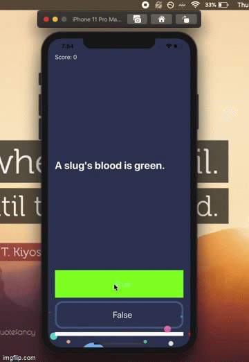

# SimpQuiz-iOS-13 
Practiced Swift development by creating quiz app that lets the user pick the right or wrong answers, plus it also keeps score and shows the progress

Demonstrated: 

- Implementing MVC design pattern to organize and simplify the quiz code. 
- Dove into creating Structs to make components more scalable. 
